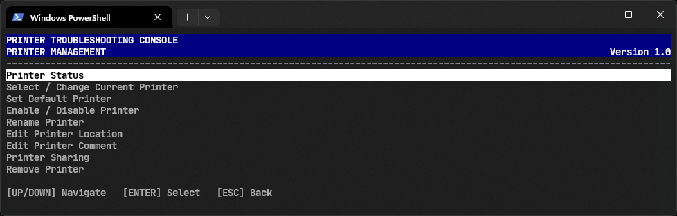
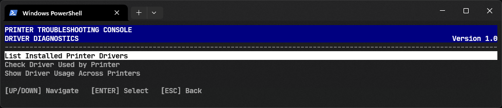
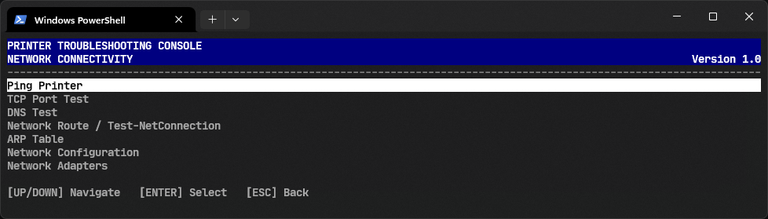
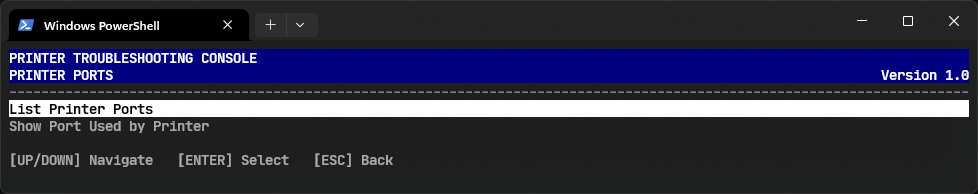
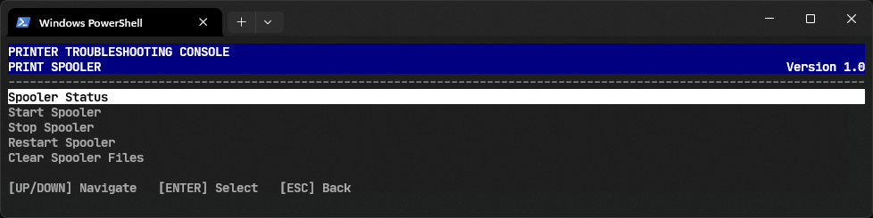
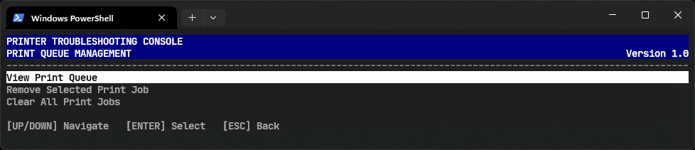
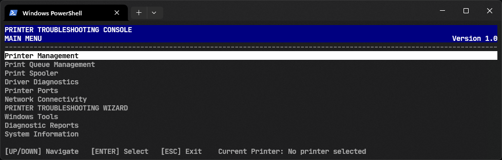

# Printer Troubleshooting Toolkit

A PowerShell-based Terminal User Interface (TUI) for performing common printer troubleshooting, diagnostics, configuration, and network connectivity checks directly from the Windows terminal.

The tool is designed for IT support technicians, system administrators, help desk personnel, and anyone who needs a quick way to troubleshoot printers without navigating through multiple Windows configuration panels.

---

## Features

### Printer Management

- Detect installed printers
- List all installed printers
- Select an active printer
- Display current printer information
- View printer status
- View printer state
- View printer driver
- View printer port
- View printer location
- View printer comment
- View printer share name
- Refresh printer information
- Set the current printer



---

### Printer Diagnostics

Perform common printer troubleshooting checks from a single interface.

Available diagnostic options include:

- Printer status check
- Printer availability check
- Printer queue check
- Print spooler check
- Printer driver check
- Printer port check
- Printer configuration check
- Network connectivity check
- TCP connectivity test
- IP address test
- DNS/hostname test
- Ping test
- Printer port connectivity
- Printer information report

---

### Driver Checking

The driver diagnostic section can be used to inspect printer driver information.

Features include:

- Display installed printer driver
- Check driver name
- Check driver version
- Check driver provider
- Check driver environment
- Check driver architecture
- Identify missing driver information
- Refresh driver information

This can be useful when troubleshooting:

- Incorrect printer drivers
- Old drivers
- Generic drivers
- Driver installation problems
- Printing failures caused by driver issues



---

### Network Troubleshooting

The network troubleshooting section provides tools for investigating network printers.

Features include:

- Ping printer IP
- Test hostname connectivity
- Test TCP connectivity
- Check printer IP address
- Check printer port
- Test common printer ports
- Test custom TCP ports
- Resolve printer hostname
- Display network configuration
- Check connection status



Common printer ports can include:

| Port | Protocol | Common Usage |
|------|----------|--------------|
| 80 | TCP | HTTP |
| 443 | TCP | HTTPS |
| 515 | TCP | LPR/LPD |
| 631 | TCP | IPP |
| 9100 | TCP | RAW / JetDirect |
| 161 | UDP | SNMP |

---

### Printer Port Diagnostics

Inspect the Windows printer port associated with the selected printer.

Information may include:

- Port name
- Port type
- IP address
- Host address
- Protocol
- Port configuration
- Network printer information



Useful for identifying problems such as:

- Incorrect IP address
- Wrong printer port
- Printer moved to another IP
- Offline network printer
- Incorrect RAW port
- Incorrect LPR configuration

---

### Print Spooler Troubleshooting

The tool can inspect the Windows Print Spooler service.

Features include:

- Check Print Spooler status
- Start Print Spooler
- Stop Print Spooler
- Restart Print Spooler
- Display service information
- Check service startup configuration



The Print Spooler is one of the most common causes of Windows printing problems.

---

### Printer Queue

Inspect the print queue of the selected printer.

Features can include:

- Display queued jobs
- Show job status
- Show document names
- Show job owner
- Show job size
- Show submission time
- Refresh queue
- Clear printer queue



Queue troubleshooting can help resolve:

- Stuck print jobs
- Documents that never print
- Jobs stuck in "Printing"
- Jobs stuck in "Deleting"
- Printer queue congestion

---

### Printer Configuration

The configuration section provides access to common printer information and configuration.

Depending on the printer and Windows configuration, the tool can inspect:

- Printer name
- Driver
- Port
- Location
- Comment
- Shared status
- Published status
- Default printer status
- Printer state
- Printer attributes

---

## Installation

Clone or download the project and place the PowerShell script in a convenient directory.

Example:

```powershell
git clone https://github.com/pipeline-voyager/Printer-Doctor.git

cd Printer-Doctor/
```

No additional PowerShell modules or external dependencies are required beyond the Windows components used by the toolbox.

## Running

Open PowerShell and execute:

```powershell
.\PrinterDoctor.ps1
```

## User Interface

The application uses a keyboard-driven TUI.



## Author

Carl Lazaro

`@pipeline-voyager`

## Version

Version 1.0
